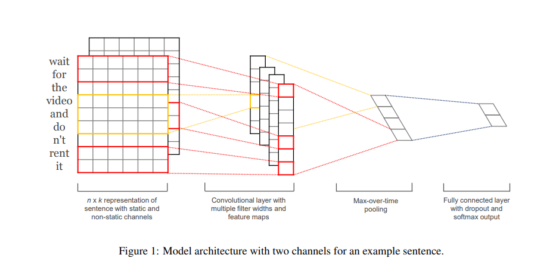
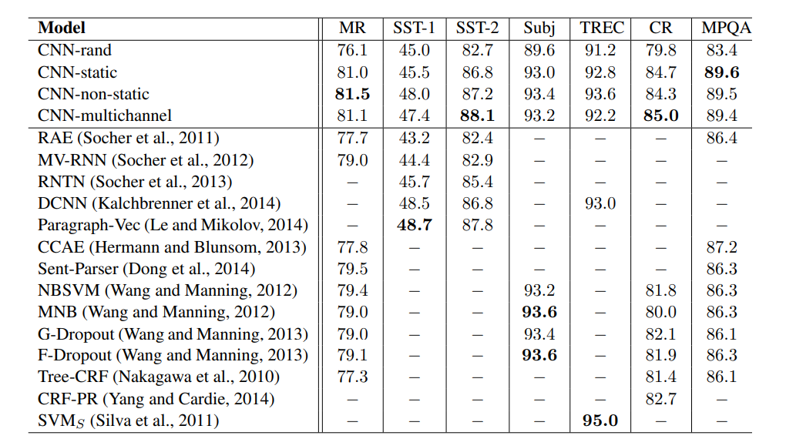

## Yoon Kim Paper review
---
### 기본 소개

[https://arxiv.org/abs/1408.5882](https://arxiv.org/abs/1408.5882)

2014년에 Yoon Kim 이라는 한국분이 쓰신 논문입니다.

현재 무려 8180회 인용된 굉장히 유명한 논문입니다.

NLP 방법중에 굉장히 가벼운 편에 속하고, 구현하기도 쉽고, 게다가 성능도 꽤 좋은 모델입니다.

당시 주로 Vision(Image) 처리에 사용되었던 convolution layer 를 nlp 에 접목시켰고, 7개의 실험중에 4가지에서 state of art 성과를 보였다고 합니다.

기본적인 모델 구성입니다. 

1. 한 단어를 1개의 vector 로 표현하고, 그 단어들을 연결하면, 한 문장이 2차원의 벡터로 구성됩니다. 
2. 완성된 문장 벡터에 convolution layer 를 1차원으로 적용해 문장의 feature map 을 얻습니다. 이때 여러 갯수의 filter width 를 사용해 여러개의 feature 맵을 얻습니다.
3. 각 Feature map 에서 가장 높은 값을 뽑습니다 (Max Pooling)
4. 뽑은 값을 Fully Connected Layer 를 이용하여 결과 값을 얻습니다.
  

### Regularization (정규화)

끝에서 두번째 layer 에 dropout 을 적용하고, l2 normalization 을 사용합니다.

지금은 많이 사용되는 기법인데, 당시에는 그렇지 않았는지 논문내에 자세한 설명이 나와 있습니다.
  

### 여러 실험 모델

1. CNN-rand : 모두 random initialize 하는 방법
2. CNN-static : word vector 를 pre-trained word2vec 에서 정의된 vector 로 고정하고 사용하는 방법
3. CNN-non-static : pre-trained word2vec 의 값을 쓰는 것은 같지만, 고정시키지 않고 find-tune 되게 사용하는 방법
4. CNN-multichannel : 2,3 을 복합적으로 사용하는 방법.  2개의 채널중 하나는 고정, 하나는 fine tune 하는 방법
  

### 결과, 분석

- Random Initialize  한 모델은 word2vec 을 사용한 것 보다 결과가 좋지 않았다.
- Multi channel 을 사용하면 overfitting 을 방지하고 더 좋은 성능을 낼거라고 예상했지만, 한 channel 의 차원을 늘려주는것이 더 좋은 성과를 내고는 했다.
- Convolution layer 를 겹쳐서 사용해봣지만, 한층의 layer 가 좋은 성능을 보였다
  

### 정리

꽤 오래된 논문이고, word2vec 을 사용해야 좋은 성능이 나왔다 라고 되어있지만, CNN-rand 모델도 여러 가지 task 에서 충분히 좋은 성능을 냅니다.

개인적으로 text classification 을 할때 base-line 으로 설정하고 가는 모델이기도 합니다.

구현하기도 쉽고, 제 깃허브 개인 프로젝트에 구현도 해 놓았으니 한번쯤 읽어보시면 도움이 될것이라고 생각합니다.

[Text Classification Project link](https://github.com/paper-cat/Text-Classifications)

model -> cnn.py 에 구현되어 있습니다.