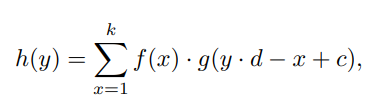
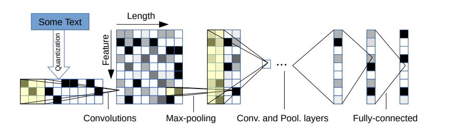
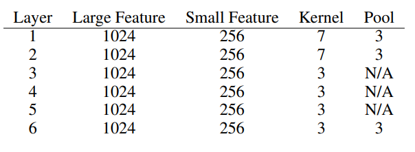
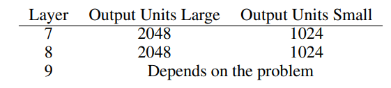
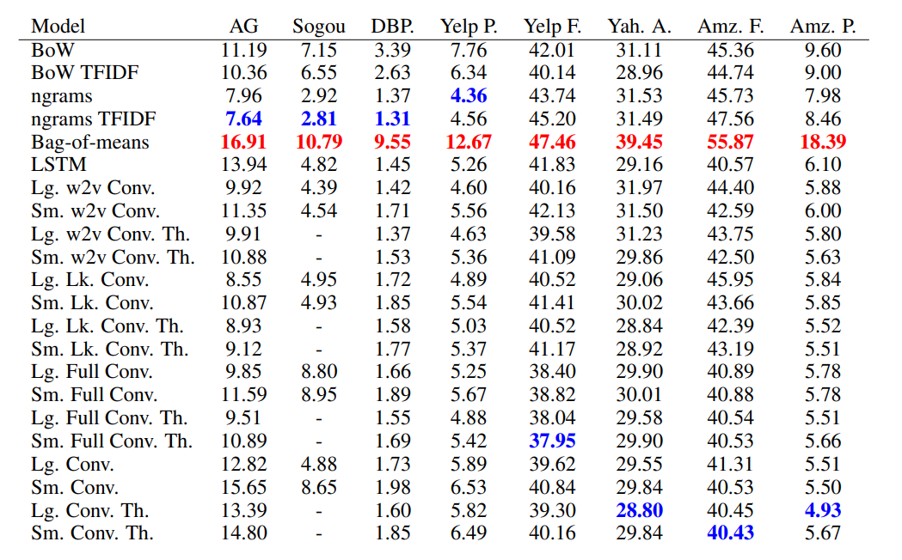

# Character level CNN Paper review
---
## 기본 소개

[https://arxiv.org/abs/1509.01626 논문 링크](https://arxiv.org/abs/1509.01626)

현재 2424회 인용된 논문입니다.

자연어 처리의 대부분의 Task 는 단어 기반으로 되어 있습니다. 2016년 당시에도 word2vec 같이 대부분의 연구가 word 기반으로 이루어졌습니다. 
이 논문에서는, 여러 convolutional network 기반 연구가 많음에 기반해 character 단위의 Text Classification 모델을 연구해 제안합니다.

## Character-level convolutional Network

### Key Module

Convolution Layer 를 key module 로 사용하고 있다고 설명합니다. (자세한 내용은 수식으로 되어 있는데)

$$c$$ : offset constant (padding)

$$d$$ : depth

$$f_{ij}(x)$$ : kernel function (weights) (i=1,2,....,m, j = 1,2,....n)

$$g_{i}$$ : input features with m input feature size

$$h_{j}$$ : output features with n output feature size

$$h_{j}(y)$$ : output by sum over i between $$g_{i}(x), f_{ij}(x)$$

복잡하게 써놨지만, 일반적인 convolutional layer 와 같습니다.

또 다른 key module 로 max pooling 을 언급합니다. Max pooling 덕분에 6개 이상의 깊은 모델을 학습할 수 있다고 합니다.

이외에 Relu 를 사용했고, optimizer 로 SGD 를, batch size 128 등등을 사용했다고 합니다.

### Character Quantization

Input 으로는, encode (one-hot encoding) 된 character 들을 일정 길이 만큼 받아서 학습한다고 합니다. 모르는 character나 빈칸의 경우는 0으로 encoding 합니다.

알파벳, 숫자, 몇가지의 특수문자들을 다 합쳐서 총 70개의 character 를 사용했다고 합니다. 대문자 소문자의 경우도 후에 실험해서 비교합니다.

### Model Design

70개의 character 를 사용했기 때문에 features 의 개수는 70개가 됩니다. 그리고 한 문장의 길이를 1014 로 고정했는데, 이정도면 대부분의 문장의 의미를 담을 수 있기 때문이라고 합니다.

마지막 3개의 Fully connected layer 사이에 2개의 Dropout 을 넣어 Regularize 했습니다.

각 Convolution layer 와 Fully Connected Layer의 Feature 수는 아래와 같습니다.

### Data Augmentation using Thesaurus

Data Augmentation 은 대부분의 Deep Learning 에 중요한 부분이다. 이 연구에서는 Data Augmentation 을 위해서 Thesaurus 라는 동의어 사전을 사용해서 문장의 단어들을 동의어로 변경한 뒤에 학습을 시켰다고 합니다. 

Text 분야에서 Data Augmentation 은 방법이 많지도 않고 효과적인 방법이 거의 없어서 개인적으로는 잘 사용하지 않는다... 근데 찾아보다 보니 Text Augmentation에 관한 방법에 대한 논문들이 있어서 나중에 공부해서 다루도록 하겠습니다.

## Result

모델, 데이터셋 별로 Error 비율을 나타낸 표입니다.

### 결론

Character level CNN 방법이 몇몇의 데이터셋에 대해 효과적인 방법인걸 알 수 있습니다. 하지만 데이터 셋의 크기등의 factor 에 의존적인 부분이 꽤 크다고 합니다.

현재에는 Bert 등의 고성능 방법이 많이 나왔지만, 그럼에도 CNN 을 Bert 에 결합해서 사용하기도 하고, 아니면 CNN를 단독적으로 빠른 학습과 예측을 위해서 사용하기도 합니다.

이 논문도 제 프로젝트에 구현되어 있습니다.
[프로젝트 링크](https://github.com/paper-cat/Text-Classifications)

