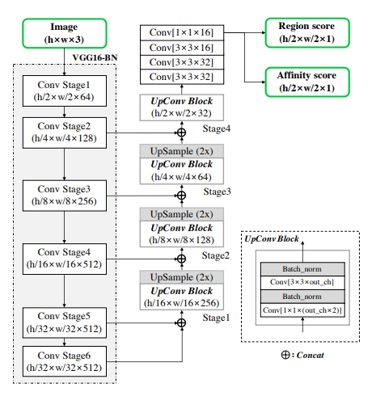

# CRAFT - Text Detection by Naver
---
## 기본 소개

[프로젝트 링크](https://github.com/paper-cat/CRAFT-detection)

이 프로젝트에서 구현하고 있는 모델은 Naver 에서 Text Detection 방식으로 제안한  CRAFT 입니다. 사실 Image Classification 만 몇가지 다뤄보고, Image Detection에 대해 공부를 많이 하지는 않아서 yolo, FastRCnn 등의 방식이 있고 어떤 식으로 작동하는지 정도만 읽어보고 구현해본 적이 없어 애매하게 아는 상태입니다. 그래도 CRAFT 논문을 읽어 보니 단적으로 나마 구현할 수 있을것 같아 시작했습니다.

[Naver의 Craft 프로젝트 링크](https://github.com/clovaai/CRAFT-pytorch)

기본적으로 네이버 클로버 팀은 pytorch 로 구현하였고, 학습 코드는 공개하지 않았습니다. 따라서 제 모델에는 다른점도 꽤 있고, 제가 임의로 간소화 시킨 부분도 있어서 많이 다릅니다.

---

## 1. Label Data 생성 방식

### Craft 방식

우선 CRAFT는 Label 데이터를 만들때 캐릭터 별로 Character Box 를 만들고, 그 안에 Gaussian map 을 넣습니다. 이를 Region Score GT 라고 합니다.

다음으로는, 한 단어에서 각 character 까리 연결을 해줍니다. 각 캐릭터의 중점들을 이용하여 연결하는 box를 만드는데 이를 Affinity Box 라고 하고, 그 안에 역시 Gaussian Map 을 넣어 Affinity Score GT 를 생성합니다.

### 구현한 방식

CRAFT 는 이 두개의 Score Map 이 Label이 되고, 이 Map 을 가지고 단어들의 위치를 파악합니다. 여기서 저는 간단하게 구현하기 위해 우선 Region Map만 사용하여  Character 의 위치를 찾기로 했습니다. 사용할 데이터가 비교적 많이 기울어진 데이터가 아니여서 가능하다고 생각했습니다. 

그리고 Character Box도 기울어지지 않은 직사각형을 사용하기로 했습니다. 주로 img label 때 사용하는 프로그램이 직사각형으로 labeling 하기 편하게 되어 있기 때문입니다.

---

## 2. Modeling

### Craft 방식

입력값으로 이미지를 받고, label 로 region, affinity map 을 갖는 모델을 사용하는데, 이 모델을 VGG16 과 U-Net 를 합친 것과 유사한 형태를 갖습니다.

왼쪽이 특성을 뽑아내는 부분이 VGG16, 나머지 부분이 Upsampling 을 통해 원하는 map을 뽑아내는 U-Net 과 유사한 방식입니다.

### 구현한 방식

위의 모델과 거의 똑같은 모델일 것이라고 생각합니다. 단지 Regional map만 사용할것이기 때문에 마지막 output 부분에 1개의 map 만 나오게 했습니다.

---

## 3. Loss Function

### Craft 방식

위의 식에서 S_c(p) 부분은 Pixel-Wise confidence 라고 하는데,  각 픽셀에서 Word 부분이 맞는지 confidence 를 계산해서 사용하는데, 인조적으로 제작한 데이터의 경우 그냥 1을 사용한다고 합니다.

나머지 부분은, 각 픽셀에서의 Regional Score, Affinity Score의 정답과의 유클리드 오차 합을 계산한 것 입니다.

### 구현한 방식

위의 식과 똑같은 방식을 사용했지만, Regional Score 만 사용하는 경우를 상정해서 Affinity Score 의 오차는 제외하고 계산하는 loss function 을 작성했습니다.

---

## Word Box

### Craft 방식 

결과로 나온 Affinity score, Regional Score를 가지고 character box를 그리고, 그에 맞는 affinirty score 를 이용해 한개의 단어로 연결해 줍니다.

### 구현한 방식

위와 같은 방법을 사용하기 어려워, character box만 그려줬습니다. Regional score 맵에서 일정 값 이상을 갖는 pixel들을 찾은뒤, 그 주변에서 가장 높은 값을 갖는 pixel 위치를 찾습니다. 거기서부터 사방의 score 를 확인하고, 감소하는 구간이 끝나는 곳까지를 그 character 의 영역으로 결정하고 box를 그렸습니다.

---

## 구현 리뷰

일단 각 단어와 character 에 맞는 기울어진 Box를 그려준다는것 자체가 어려운 일이고, 너무 오랜 시간이 걸릴것 같아 주어진 데이터와 만들기 쉬운 데이터 방식으로 사용할 수 있게 구현해 보았습니다. 실제로 너무 달라붙어 있는 단어가 아니면 꽤 잘 검출해내는것을 확인했습니다.

논문 마지막에 End-to-End 방식으로 단어 값까지 검출해내는 방식을 도전하겠다고 해놓았는데, 아마 검출한뒤 classification 부분을 모델 자체에 포함시킬 예정인 것 같습니다.

Image Detection 에 지식이 많지 않아 구현하는데 어려움이 조금 있었지만, 다른 모델들 보다 비교적 직관적인 Text Detection 모델이였다고 생각합니다.

앞으로 Affinity Score Map 을 이용한 예측 모델도 계속 구현해 볼 예정입니다.

감사합니다.

[프로젝트 링크](https://github.com/paper-cat/CRAFT-detection)
