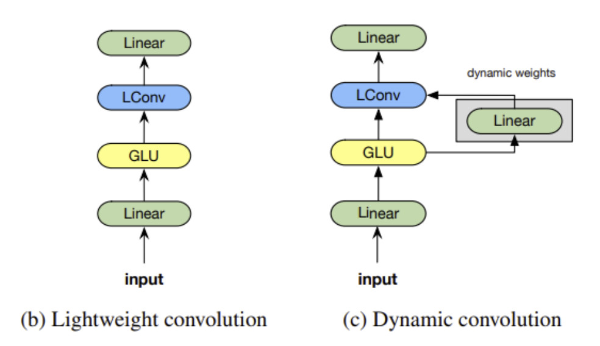
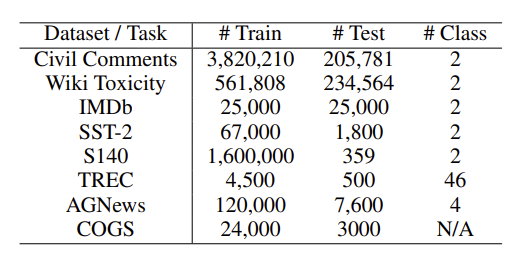
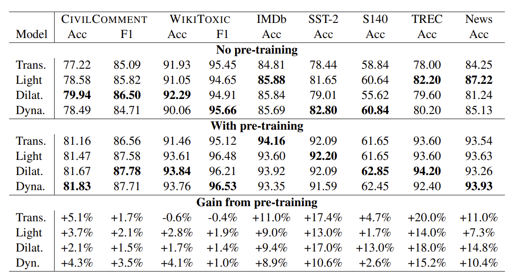

# BERT보다 CNN? 논문 리뷰. Are Pre-trained Convolutions Better than Pre-trained Transformers? - ACL 2021
---
## 읽기 전에

ACL 2021에서 Google 이 발표한 논문이다. 

현재 자연어 관련  Task 는 Transformers의 Encoder, Decoder를 이용한 Architecture 를 가지는 Pre-Trained Language Model이 독식하고 있는 상황이다. 개인적으로 CNN의 성능이 좋은 경우를 많이 확인하기도 했고, BERT 유형의 모델이 유행하는 시기이다 보니 논문 제목이 유독 눈에 띄어 읽어 보았다. 

[https://arxiv.org/abs/2105.03322 논문 링크](https://arxiv.org/abs/2105.03322)

## Abstract

현재 Pre-trained Transformers는 사실상 우선적으로, 필수적으로 사용되는 모델이다. 반면 Pre-Trained CNN은 거의 사용되지 않는다. 이런 상황에서 이 Paper에서는 CNN이 Transformers보다 좋은 성능을 낼 수 있는지 8가지 Dataset/Task 에 대해 실험한다. 그리고 실험 결과 CNN이 여러 측면에서 경쟁력 있음을 볼 수 있었다고 한다.

## Introduction

현재 Pre-Training 은 Transformers 구조의 모델들과 뗄수 없는 관계라고 보고 있다. (BERT, RoBERTa, T5등) 현재 Transformers 구조가 아닌 Pre-Training 모델은 거의 존재하지 않는다. 이 내용은 NLP에 국한된 의견이라고 볼 수 있다.

Contextual Representation 학습의 역사는 오래되었다 (2014년 부터). 하지만 근래의 Pre-Trained Language model은 Recurrent 형태를 가지는 Elmo (2018년) 부터 시작되었다. 이런 연구 시작 기간의 차이때문에 Pre-Training Convolution 모델에 대한 연구는 많이 않은것 같다. 또한 이 논문에서 말하듯, NLP 영역에서는 이미 Transformers의 성능이 최고로 여겨지고 있기 때문에 그 외의 모델에 대한 연구는 거의 이루어 지지 않은것으로 보인다.  

하지만 최근의 몇몇 연구는 Convolution model의 가능성을 입증하고, Transformers 같은 Self-Attention 구조의 필요성에 의문을 보이고 있다고 한다. 한 논문(Wu et al., 2019)에서는 Convolution Seq2Seq 모델이 몇몇 부분에서 Transformers 의 성능을 앞선다고 주장했다. 따라서, Transformers가 아닌 다른 모델들의 Pre-Training 방식을 고려해 보아야 한다고 주장한다.

실제로 Convolution Model 에는 몇 가지 분명한 장점이 있다.
1. Self-Attention과 다르게 엄청난 Memory Complexity의 영향을 받지 않는다.
2. Local 하게 작동하기 때문에, Positional Encoding의 영향을 받지 않는다. 이는 여러 문장을 사용하는 경우 Global Information을 얻지 못하기 때문에 단점이 되는 경우도 있다.

## 사용된 Pre-Trained Convolution Models

이 논문의 실험에서는 가장 좋다고 생각되는 LightWeight Convolutions, Dynamic Convolutions (Pay Less Attention with Lightweight and Dynamic Convolutions 에서 소개됨), Dilated Convolutions를 사용하였다. 

[Pay Less Attention with Lightweight and Dynamic Convolutions 논문 링크](https://arxiv.org/abs/1901.10430)

위 논문에서의 LightWeight Convolutions, Dynamic Convolutions를 간단히 소개하면

- LightConv는 위의 논문에서 제안한 모델이다. Output channel 을 공유하고, weights 를 sharing하고,  softmax 를 사용해 normalize 하여 사용하는 depthwise conv (각각의 채널을 독립적으로 Convolve 하는 Conv모델) 모델이다.

- Dynamic Convloutions은 위의 그림처럼 time-step dependent kernel을 사용하는 conv 모델이다.

- 마지막으로 Dilated Convolutions는 이 논문에 소개되지는 않았다. 이 모델은 일단적인 Convolution의 커널 사이에 간격을 주는 방식을 사용하는 모델이다.

## Research Questions (RQ)

실제 실험을 진행하기 전에, 연구 측면에서 확인해볼 아래와 같은 5가지 Research Question을 만들었다고 한다.

1. Convolution 이 Transformers 처럼 Pre-Training의 이점을 얻는지
2. Convolution 모델들이 Transformers 과 비교하여 경쟁력이 있는지 (Pre-Train을 포함하는 경우와 하지 않는 경우 모두)
3. Pre-Trained Convolution이 Pre-Trained Transformers에 비해 가지는 장점은 무었인지
4. Pre-Trained Convolution이 효과적이지 않은 경우는 언제인지
5. 여러개의 Convolution 모델 중, 가장 좋은 모델이 존재하는지

## Experiments, Results

이 논문의 실험에서 사용된 Dataset은 다음과 같다

여러 Dataset에 대한 실험 결과는 다음과 같다

결과에서 볼 수 있듯이, 대부분의 경우에 Convolution이 좋은 성능을 보였다.

학습 속도와, 학습 Operations 숫자는 위와 같은 모습을 보였다.

추가적인 결과로, Cross Attention이 없기 때문에 2문장 이상을 사용해야 하는 Task 에는 부적절한 성능을 보였다. SQuAD같은 경우 Transformers 는 약 90의 F1 score를 보이는데, Convolution은 70정도의 성능만 보였다. 하지만 Convolution에 딱 한개의 Cross Attention Encoder만 추가해도 Transformers와 유사한 성능을 보였다.

이러한 결과를 통해 위의 Research Question들에 답을 하면,

1. Pre-Training 의 장점은 Transformers에 국한된 것이 아니다.
2. Convolution이 더 좋은 성능을 보였다.
3. Convolution이 더 빠른 학습을 보였고, 필요한 학습 machine성능도 더 낮았다.
4. SQuAD 와 같은, 2개 이상의 문장을 사용하는 Task 의 경우 낮은 성능을 보였다.
5. Dilated, Dynamic Conv가 LightWeight보다 더 좋은 성능을 보였다.

## 결론

Convolution 모델들이 Transformers 보다 Pre-Train의 유무에 관계 없이 더 좋은 성능을 낼 수 있었다. 더욱이 속도등에서도 더 좋은 경우가 많았다. 아직 Pre-Trained Convolution Language Model 의 연구가 부족하기에 앞으로 연구 가능성이 많다.

또한, Pre-Trained 방식의 연구과 Architecture의 연구는 독립적으로 고려되어야 한다.

## 읽은 후기

NLP 영역에서 Convolution을 사용한 모델이 이렇게 좋은 성능을 낼 수 있을 것이라고는 생각하지 못했다. 실제로 NLP에 사용해본 Convolution 모델은 Yoon Kim의 CNN모델이나 Recurrent 와 함께 Convolution을 사용한것 이었고, Convolution만을 사용한 더 복잡한 모델은 사용할 생각을 하지 못했던 것 같다.

언제부터인가 NLP Task가 주어지면 BERT, BART 먼저 테스트 해보는게 당연한것으로 생각하곤 했다. 아마 여러 Attention 모델들이 압도적인 성능을 보여줬기 때문인것 같다. 하지만 이 논문에서 말하는 것처럼 Pre-Training과 Model Architecture는 분리해서 성능 판단을 해야 할것 같다. 또, 현재 Transformer 에 너무 국한되지 않고 여러가지를 시도해보는 것도 필요하다고 느껴졌다.

